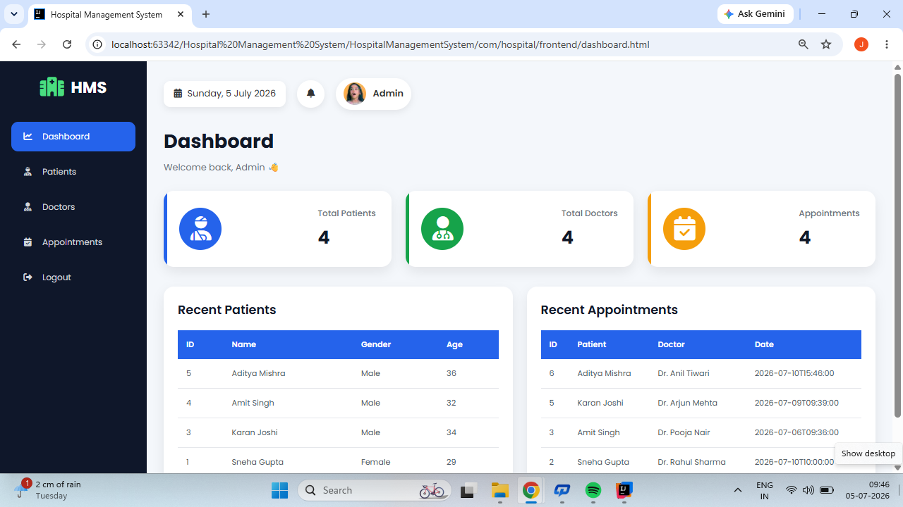

# 🏥 Hospital Management System

A full-stack Hospital Management System developed using **Spring Boot, Java, MySQL, HTML, CSS, JavaScript, Bootstrap, and JWT Authentication**.

The system helps hospitals manage doctors, patients, appointments, and prescriptions through a secure admin dashboard.

---

## 🚀 Features

- 🔐 Secure JWT Authentication
- 👨‍⚕️ Doctor Management (CRUD)
- 🧑 Patient Management (CRUD)
- 📅 Appointment Management (CRUD)
- 💊 Prescription Management (CRUD)
- 📊 Dashboard with Live Statistics
- 📱 Responsive Admin Dashboard
- 🌐 REST APIs using Spring Boot
- 💾 MySQL Database Integration

---

## 🛠️ Technologies Used

### Backend
- Java
- Spring Boot
- Spring Security
- JWT Authentication
- Spring Data JPA (Hibernate)
- MySQL

### Frontend
- HTML5
- CSS3
- Bootstrap 5
- JavaScript (Fetch API)

### Tools
- IntelliJ IDEA
- MySQL Workbench
- Postman
- Git
- GitHub

---

## 📸 Screenshots

### Login Page


---

### Dashboard



---

### Doctor Management


---

### Patient Management


---

### Appointment Management


---

## 📂 Project Structure

```
Hospital-Management-System
│
├── src
│   ├── main
│   │   ├── java
│   │   └── resources
│   │       └── static
│   └── test
│
├── screenshots
│
├── pom.xml
│
└── README.md
```

---

## ⚙️ Installation

1. Clone the repository

```bash
git clone https://github.com/jeetendra332/Hospital-Management-System.git
```

2. Open the project in IntelliJ IDEA.

3. Configure MySQL.

4. Update `application.properties`.

5. Run the Spring Boot application.

6. Open:

```
http://localhost:8080/login.html
```

---

## 🔐 Authentication

The application uses **JWT (JSON Web Token)** for secure authentication and authorization.

---

## 📌 Future Enhancements

- Role-Based Access Control
- Billing Module
- Reports Module
- Dashboard Charts
- Email Notifications
- Docker Deployment
- Cloud Deployment

---

## 👨‍💻 Author

**Jeetendra Singh**

GitHub: https://github.com/jeetendra332

